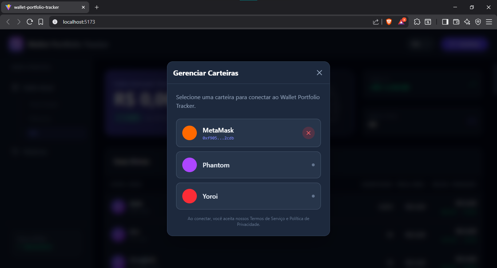
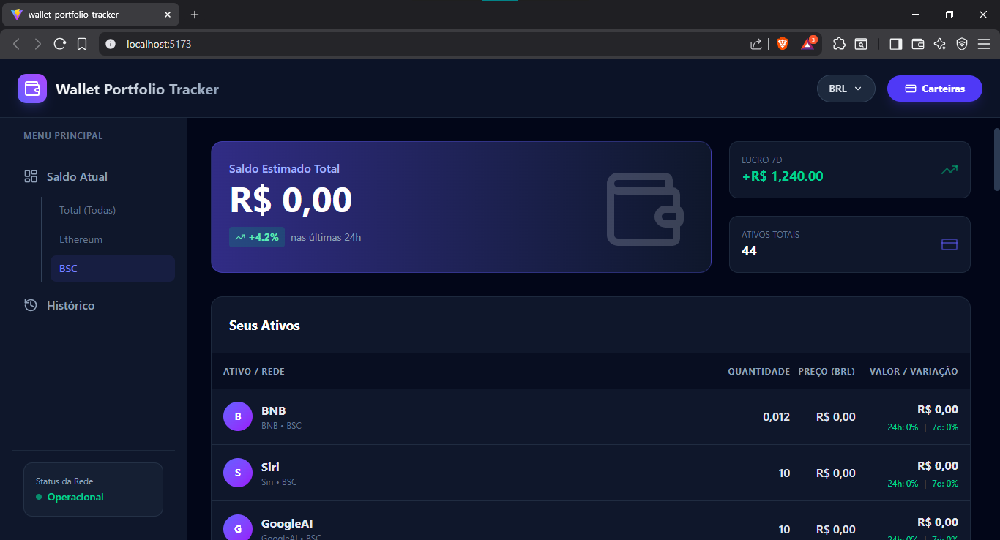
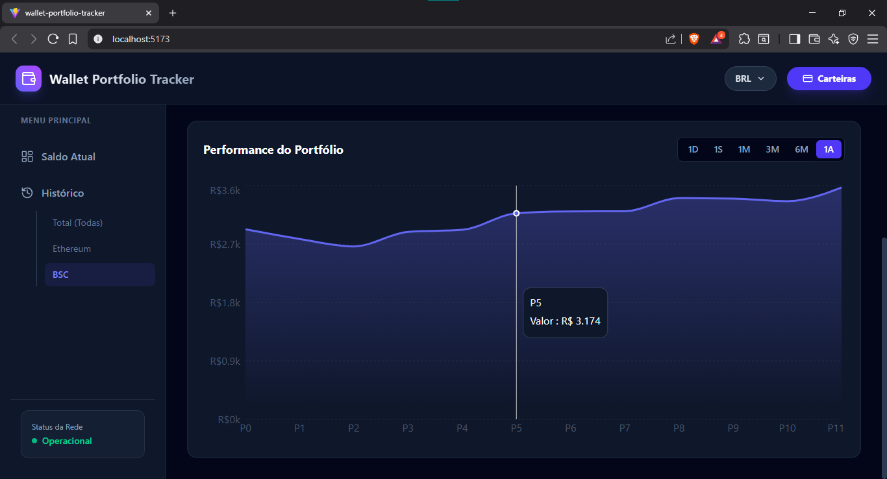

# Wallet Portfolio Tracker

Um rastreador de portfólio de carteiras. (BSC, ETH, Cardano e Solana)

## Visão Geral

Esta aplicação permite aos usuários visualizar e rastrear o valor de seus ativos na blockchain Cardano.

## Preview da Interface

<!-- Adicione aqui screenshots da aplicação -->




## Tecnologias Utilizadas

*   React
*   Vite
*   TypeScript
*   Tailwind CSS
*   BlockCains web APIs

## Como Executar a Aplicação

Siga as instruções abaixo para configurar e executar o projeto em seu ambiente local.

### Pré-requisitos

*   Node.js (versão 18 ou superior)
*   npm

### Instalação

1.  Clone o repositório:
    ```bash
    git clone https://github.com/poweron0102/wallet-portfolio-tracker.git
    ```

2.  Navegue até o diretório do projeto:
    ```bash
    cd wallet-portfolio-tracker
    ```

3.  Instale as dependências:
    ```bash
    npm install
    ```

### Executando a Aplicação

Após a instalação das dependências, você pode iniciar o servidor de desenvolvimento:

```bash
npm run dev
```

A aplicação estará disponível em `http://localhost:5173`.
